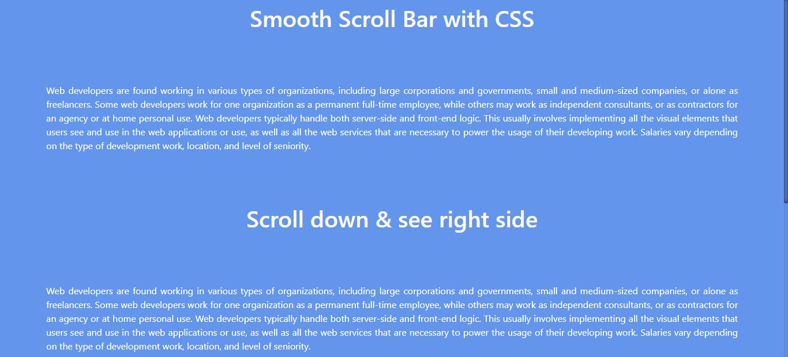
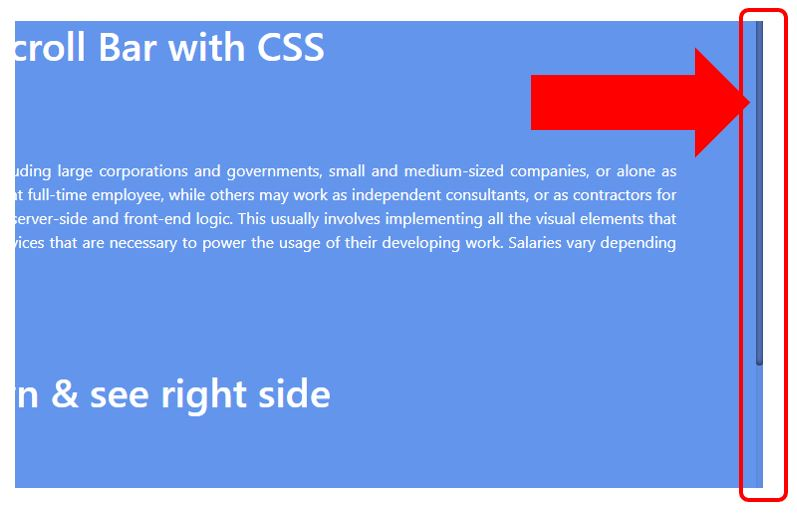

# Smooth-Scroll-Bar-with-CSS
Create smooth scroll bar with only using CSS

💻😍 Online Demo : https://smooth-scroll-bar-with-css.netlify.app/

### Table of Content
-01 [What is this?](#What) 
-02 [What are the technologies used?](#technologies) 
-03 [How to used this?](#How) 

## What is this?<a name="What"/>
This is about adding a simple smooth scroll bar to our web site.

## What are the technologies used?<a name="technologies"/>
- HTML
- CSS

## How to use this?<a name="How"/>
You can modify the default scroll bar to a modern simple smooth scroll bar by adding a simple CSS code line.

